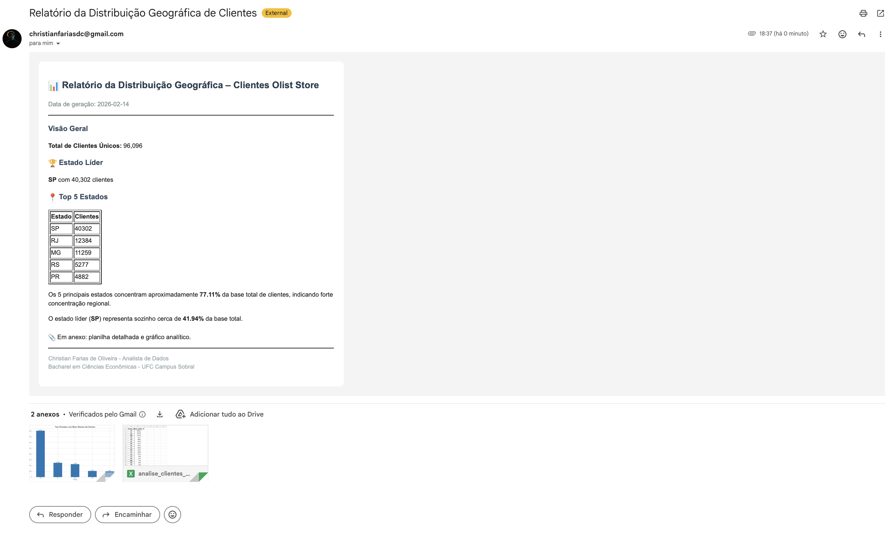

# 📊 Relatório Automatizado de Distribuição Geográfica de Clientes

[]
[]

> Sistema automatizado em Python para geração e envio de relatório executivo com métricas geográficas de clientes via e-mail.

---

# 📌 Preview do Relatório

  

---

## 🎯 Sobre o Projeto

Este projeto foi desenvolvido com o objetivo de simular um **cenário real corporativo**, onde relatórios executivos precisam ser gerados automaticamente e enviados periodicamente para stakeholders.

O sistema realiza:

- Processamento da base de clientes  
- Cálculo de métricas estratégicas  
- Geração de visualização gráfica  
- Exportação analítica em Excel  
- Envio automatizado de e-mail em HTML  

---

## 📊 Base de Dados

Utiliza o conjunto público de e-commerce brasileiro disponibilizado pela Olist:

- ~100 mil pedidos  
- Dados anonimizados  
- Informações geográficas por estado  

Arquivo utilizado: data/olist_customers_dataset.csv

---

## 🚀 Funcionalidades

### 📈 Análise Geográfica
- Total de clientes únicos  
- Clientes por estado  
- Ranking Top 5 estados  
- Percentual de concentração regional  
- Representatividade do estado líder  

### 📊 Visualização
- Gráfico de barras dos 5 principais estados  
- Exportação automática em `.xlsx`  

### 📧 Relatório Executivo
- Template em HTML estilizado  
- Tabela dinâmica incorporada  
- Insights interpretativos automáticos  
- Anexos (Excel + gráfico PNG)  
- Envio via SMTP com variável de ambiente  

---

## 🛠️ Stack Tecnológica

### Core
- **Python 3.10+**
- **Pandas**
- **Matplotlib**

### Automação
- **smtplib**
- **email.message**
- **python-dotenv**

---

---

## 🔐 Segurança

As credenciais de e-mail são protegidas por variáveis de ambiente (`.env`), evitando exposição de informações sensíveis no código.

---

## 🔄 Possível Automação

O script pode ser integrado a:

- Task Scheduler (Windows)
- Cron Job (Linux/Mac)
- Servidor Cloud (AWS / GCP / Azure)

Permitindo envio:

- Diário  
- Semanal  
- Mensal  

---